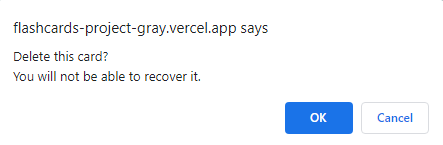

# Simple Study
***For the Everyday Student***

Simple Study is a flashcard application designed to meet the needs of the everyday student. The easily accessible and well designed application makes it easy for students to read and review flashcards, as well as create separate decks of cards for other categories. This allows the users to fully customize their learning experience.

Here is a link to the **[Live Site](https://flashcards-project-gray.vercel.app/)**

## Decks
Here is a quick breakdown of different functions and views you can perform with the flashcard decks.

### Dashboard
The application begins with the **Dashboard** which holds displays all the decks of flashcards. Please note the buttons **Create Deck** which would allow you to create a new deck of flashcards. Once created, each deck has the option to **View**, **Study** or **Delete** a deck of flashcards.

### Create Deck
The **Create Deck** page allows the user to create a new deck of flashcards. Each deck will simply require a deck name and description for the deck. 

### View
Viewing a deck will provide you with the name, description, and a list of all of the flashcards associated with the deck.

### Study

The study page will allow the user to flip through the flashcards. This is where all the studying really begins as it mimics a real life flashcard with both sides. The front will have a question, while the backside has the answer. Once ready, the user can simply click the **flip** button to reveal the other side of the card.

### Delete Deck
When you click on the **Delete** button, an alert confirmation window will pop up. This is just to make sure that the user did not misclick anything and confirms the whether or not they would want to delete the deck. 

## Cards
Each flashcard will have a front and a back. The front is designed to pose a question for the user to answer. The answer will be on the back of the flashcard and can be accessed when the card is "flipped" in the study page. The back of the card should also be displayed when all the cards are listed under their respective decks.

### Create Card
The create card page will allow the user to create new flashcards which relate to a specific deck. Each card will require the a **front side** which should pose as a question and a **back side** which should provide the answer. 

### Edit Card
Users can feel free to edit their cards. This will allow them to change both the **front side** and **back side** of the flashcard that they created. The card will default to its original content, but it can be freely edited in this page.

### Delete Card
When you click on the **Delete** button, an alert confirmation window will pop up. This is just to make sure that the user did not misclick anything and confirms the whether or not they would want to delete the card. 

